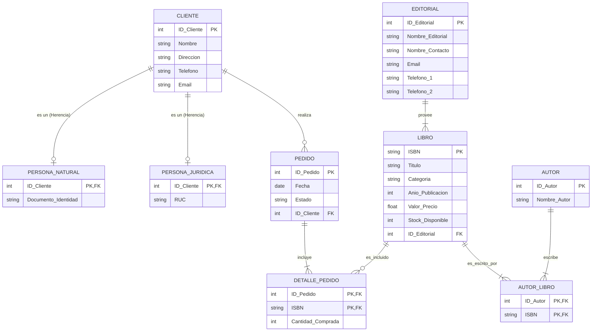

# Diseño Conceptual de la Base de Datos (Librería/Tienda)

Este documento detalla el modelo conceptual y relacional de la base de datos solicitada, cumpliendo con las reglas de negocio descritas. Para una visualización gráfica, se incluye un diagrama interactivo en formato **Mermaid**.

---

## 1. Diagrama Entidad-Relación (Mermaid)

---

## 2. Descripción Detallada del Diseño

### A. Jerarquía de Generalización (Herencia)
* **Superclase:** `CLIENTE`
* **Subclases:** `PERSONA_NATURAL` y `PERSONA_JURIDICA`
* **Implementación Relacional:** Se utiliza el patrón **Class Table Inheritance (Tabla por Subclase)**. La tabla `CLIENTE` contiene los atributos comunes. Las tablas hijas (`PERSONA_NATURAL` y `PERSONA_JURIDICA`) tienen como llave primaria (`PK`) el mismo `ID_Cliente`, el cual funciona a su vez como llave foránea (`FK`) apuntando a la superclase. Esto asegura la consistencia de datos y la relación 1:0..1 disjunta (un cliente solo existe en una de las subclases).

### B. Atributos Multivaluados (Restricción de Teléfonos)
* El requerimiento indica que una `EDITORIAL` puede tener un máximo de 2 números telefónicos. 
* **Solución:** En lugar de crear una tabla adicional de teléfonos (lo cual se haría si la cantidad fuera ilimitada), la mejor práctica para optimizar el rendimiento y aplicar la restricción estricta de un máximo de 2 es aplanar los atributos en la propia entidad como `Telefono_1` y `Telefono_2` (donde `Telefono_2` es opcional/nullable).

### C. Relación de Muchos a Muchos (M:N)
1. **PEDIDO y LIBRO (Relación CONTIENE):**
   * Se resuelve mediante la tabla asociativa `DETALLE_PEDIDO`.
   * **Atributo propio:** `Cantidad_Comprada`. Este campo permite registrar cuántas unidades de un libro específico se adquieren en un pedido.
2. **AUTOR y LIBRO (Relación ESCRIBE):**
   * Se resuelve mediante la tabla puente `AUTOR_LIBRO`.
   * Esto permite que un libro tenga coautores (1 a N) y que un autor pueda escribir múltiples libros (1 a N).

### D. Gestión del Inventario (Regla de Negocio)
* La entidad `LIBRO` cuenta con el atributo `Stock_Disponible`.
* **Operación:** Antes de insertar un registro en `DETALLE_PEDIDO`, a nivel de aplicación (software/backend) se debe consultar el `Stock_Disponible` del libro. Si `Cantidad_Comprada <= Stock_Disponible`, se permite la transacción y se resta dicha cantidad del inventario; de lo contrario, se rechaza la operación.
